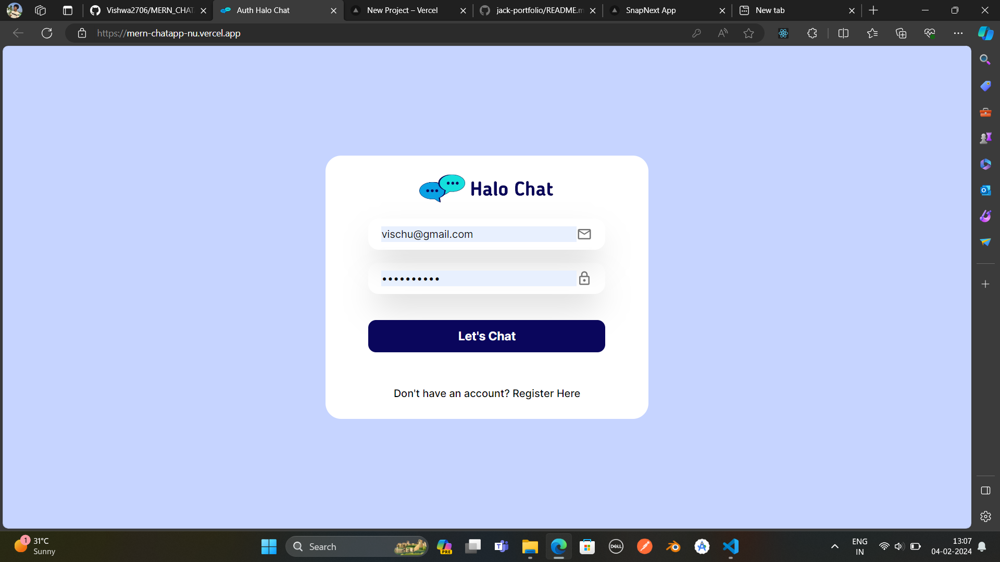
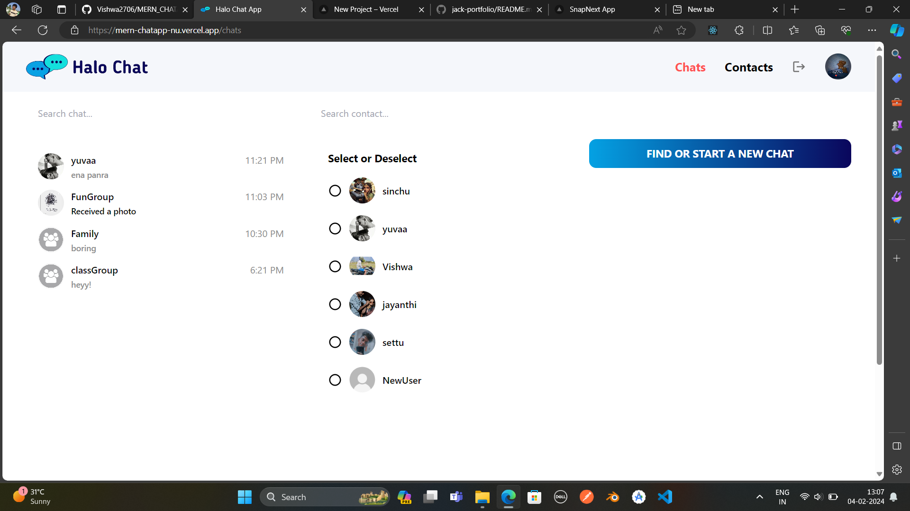
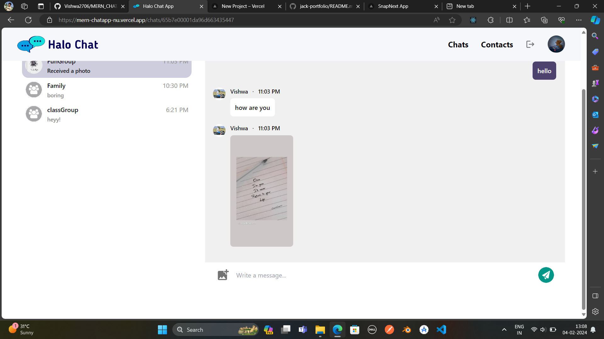

<h1>Project Details</h1>

Real-Time chat app using Next.js, NextAuth, MongoDB, Pusher, Tailwind CSS, React, and Cloudinary.

Next.js:

Next.js is a React framework that enables server-side rendering, automatic code splitting, and easy deployment.
It simplifies the development of React applications by providing a structure and tools for building efficient and scalable web applications.
NextAuth:

NextAuth is an authentication library for Next.js applications.
It supports various authentication providers such as Google, GitHub, and others.
It simplifies the implementation of authentication flows and integrates seamlessly with Next.js applications.
MongoDB:

MongoDB is a NoSQL database that stores data in a flexible, JSON-like format.
It is used to store user data, chat messages, and other relevant information in a scalable and easily accessible manner.
Pusher:

Pusher is a real-time communication service that enables real-time data updates.
It can be used to implement real-time chat functionality by pushing messages instantly to connected clients.
Tailwind CSS:

Tailwind CSS is a utility-first CSS framework that makes it easy to design and style your components.
It allows you to build a responsive and visually appealing user interface with minimal effort.
React:

React is a JavaScript library for building user interfaces.
It is used to create the frontend of the chat application, managing the UI components and rendering updates in response to real-time events.
Cloudinary:

Cloudinary is a cloud-based service that provides image and video management.
It can be used to store and manage user avatars or chat-related images in the cloud, making it easy to handle media assets in the application.
Architecture Overview:

Authentication:

Users authenticate using NextAuth with various providers.
Upon successful authentication, user information is stored in MongoDB.
Real-Time Chat:

Chat messages are stored in MongoDB and synchronized in real-time using Pusher.
When a user sends a message, it's stored in the database and instantly broadcasted to all connected clients using Pusher.
User Interface:

The frontend is built using React and styled with Tailwind CSS.
Users can view and send messages in real-time, and the UI updates dynamically based on new messages.
Media Handling:

Cloudinary is used to manage user avatars and chat-related images, providing a scalable and efficient solution for storing and serving media assets.
Deployment:

The application can be deployed on platforms like Vercel or Netlify for easy scaling and maintenance.
This architecture provides a scalable, real-time chat application with a robust authentication system, efficient data storage, and a visually appealing user interface.


This is a [Next.js](https://nextjs.org/) project bootstrapped with [`create-next-app`](https://github.com/vercel/next.js/tree/canary/packages/create-next-app).

## Getting Started

First, run the development server:

```bash
npm run dev
# or
yarn dev
# or
pnpm dev
# or
bun dev
```

Open [http://localhost:3000](http://localhost:3000) with your browser to see the result.

You can start editing the page by modifying `app/page.js`. The page auto-updates as you edit the file.

This project uses [`next/font`](https://nextjs.org/docs/basic-features/font-optimization) to automatically optimize and load Inter, a custom Google Font.

## Learn More

To learn more about Next.js, take a look at the following resources:

- [Next.js Documentation](https://nextjs.org/docs) - learn about Next.js features and API.
- [Learn Next.js](https://nextjs.org/learn) - an interactive Next.js tutorial.

You can check out [the Next.js GitHub repository](https://github.com/vercel/next.js/) - your feedback and contributions are welcome!

## Deploy on Vercel

The easiest way to deploy your Next.js app is to use the [Vercel Platform](https://vercel.com/new?utm_medium=default-template&filter=next.js&utm_source=create-next-app&utm_campaign=create-next-app-readme) from the creators of Next.js.

Check out our [Next.js deployment documentation](https://nextjs.org/docs/deployment) for more details.


